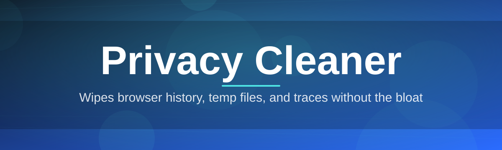
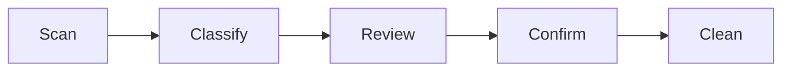

# privacy-cleaner-utility 🧹🔒

  

*Sweep away the digital dust your PC quietly hoards — one honest scan at a time.*

## 📖 Overview

Every machine keeps a diary it never asked to write. Browser caches, leftover registry fragments, thumbnail vaults, autofill trails, temp folders that never got the memo to self-destruct — they pile up silently until your disk feels cluttered and your sense of privacy feels borrowed rather than owned. **privacy-cleaner-utility** was built to hand that diary back to you, page by page, so you decide what stays and what gets shredded.

This project exists because most "cleaner" tools on the market are either bloated with upsells, vague about what they actually touch, or so aggressive they break things you cared about. We wanted something different: a transparent, single-purpose privacy cleaner for Windows that explains every action in plain language before it happens, respects your system's boundaries, and never phones home with your data. No accounts, no telemetry, no dark patterns — just a tool that does the one job it promises.

It's for the everyday user who wants a tidier, faster PC without becoming a systems administrator overnight. It's for the privacy-conscious professional who shares a laptop and doesn't want browsing history lingering behind. And it's for the tinkerer who appreciates open, auditable software over black-box "trust us" cleaners. If any of that sounds like you, welcome — you're in the right README.

> [!NOTE]
> privacy-cleaner-utility is a **standalone Windows application**. There's nothing to compile and nothing to configure before your first scan — download, launch, clean.

  

---

## ✨ What's Inside the Toolbox

privacy-cleaner-utility isn't a single button — it's a small constellation of purpose-built tools that each tackle a different flavor of digital residue. Here's the lineup:

- **Deep Trace Sweep** — hunts down browser history, cookies, cached form data, and autofill remnants across Chrome, Edge, and Firefox-based browsers, then lets you review the findings before anything is removed.

- **Temp & Junk Excavator** — digs through Windows temp directories, prefetch leftovers, and installer debris that Explorer conveniently hides from casual view, reclaiming gigabytes most users never knew existed.

- **Registry Whisperer** — flags orphaned registry keys left behind by uninstalled software, presenting them with plain-English context instead of cryptic hex paths, so cleanup never feels like guesswork.

- **Recent Activity Eraser** — clears jump lists, "Recently Opened" entries, and Explorer search history in one motion, ideal before handing a device to a colleague, kiosk, or family member.

- **Thumbnail Cache Reset** — wipes the hidden image cache Windows builds from every photo you've ever previewed, freeing space and closing a quiet visual privacy gap.

- **Scheduled Privacy Rounds** — set the cleaner to run a lightweight pass automatically at intervals you choose, so tidiness becomes a habit rather than a chore.

- **Selective Undo Basket** — nothing vanishes without a receipt; recently cleaned items sit in a temporary basket so a misclick never costs you something important.

- **Report Card Export** — every session generates a readable summary of what was found and what was cleared, so you always know exactly what happened on your machine.

> [!TIP]
> Run **Deep Trace Sweep** right before demoing your screen or handing your laptop to IT support — it takes under a minute and closes the most common oversharing gaps.

---

## 🚀 Getting Started, Step by Step

Think of this as making tea, not assembling furniture. Four steps, no manual required.

1. **Visit the landing page.** Click either download button on this page to reach the official project site.

2. **Grab the latest build.** The page always points to the current release for 2026 — no digging through folders of old versions.

3. **Launch the executable.** privacy-cleaner-utility runs standalone; there's no installer wizard demanding admin rights over your whole system just to say hello.

4. **Run your first scan.** Choose a module, review what it finds, and confirm the clean. That's it — you're now the person your PC's registry fears.

> [!IMPORTANT]
> Close your browser windows before running **Deep Trace Sweep** for the most accurate results — active sessions can lock certain cache files mid-scan.

---

## 🖥️ System Requirements

Nothing exotic here. If your machine can open a browser tab, it can run this.

| Component | Minimum | Recommended |
|---|---|---|
| **OS** | Windows 10 (64-bit) | Windows 11 (64-bit) |
| **RAM** | 2 GB | 4 GB or more |
| **Disk** | 100 MB free space | 500 MB free space (for logs & undo basket) |

> [!NOTE]
> No .NET installs, no runtime downloads, no background services. privacy-cleaner-utility is dependency-free by design — what you download is what runs.

---

## ⚙️ How It Works

Under the hood, the cleaning pipeline follows a deliberately simple, auditable path — no hidden background daemons, no mystery scheduled tasks sneaking into Task Scheduler.

1. **Scan** — the utility walks known privacy-relevant paths (browser profiles, temp directories, registry hives) using read-only access.

2. **Classify** — every item found is tagged by category and risk level, so you always know whether something is cosmetic clutter or a genuine privacy trail.

3. **Present** — results land in a review screen; nothing is touched automatically unless you've explicitly enabled scheduled rounds.

4. **Confirm** — you approve, adjust, or skip individual items with granular checkboxes.

5. **Clean & Log** — approved items move to the undo basket first, then a plain-text report is written summarizing the session.

---

## 🩹 Troubleshooting Corner

<strong>The scan says "Access Denied" on some registry keys — is that normal?</strong>

Yes. Certain keys are owned by system processes and Windows protects them even from privacy tools running with elevated rights. The utility simply skips these and logs them as "protected" rather than forcing the issue.

<strong>Will running this remove my saved passwords?</strong>

No. privacy-cleaner-utility targets caches, temp files, history, and cosmetic traces — it deliberately avoids credential stores and password managers. That's a boundary we don't cross.

<strong>I accidentally cleaned something I needed — can I get it back?</strong>

Check the **Selective Undo Basket** first; recently cleaned items are held there temporarily before permanent deletion. If it's already been purged from the basket, unfortunately it's gone for good — that's why review-before-confirm exists.

<strong>My antivirus flagged the download — should I worry?</strong>

Some antivirus heuristics flag any tool that touches temp files or the registry, purely because that behavior overlaps with lower-quality software. Grab the build only from the official landing page linked in this README, and you're getting exactly what the project ships.

<strong>Does scheduled cleaning run even when the app is closed?</strong>

No hidden services run in the background. Scheduled Privacy Rounds only fire when the app itself is open and idle, keeping resource use and surprises to a minimum.

> [!WARNING]
> Always review the Registry Whisperer results before confirming a clean on a work or shared machine — some line-of-business software leaves keys behind that are still referenced by license checks.

---

## 🎨 Interface, Shortcuts & Themes

privacy-cleaner-utility keeps its interface calm and legible — no flashing progress bars pretending to do more work than they are.

**Keyboard shortcuts:**

- `Ctrl + N` — start a new scan
- `Ctrl + R` — open the last report
- `Ctrl + U` — jump straight to the undo basket
- `Ctrl + ,` — open settings
- `F5` — refresh current scan results

**Appearance:**

- Light and Dark themes, both tuned for long review sessions without eye strain
- Adjustable list density (compact vs. comfortable) for the results table
- Optional high-contrast mode for accessibility

**Settings worth knowing about:**

- Toggle which modules participate in scheduled rounds
- Set undo basket retention (from a single session up to seven days)
- Choose whether reports export as plain text or CSV

  

---

## 🤝 Contributing & Community

This project grows because people like you notice a rough edge and decide to smooth it out. Whether that's fixing a typo in a tooltip, proposing a new detection rule, or reporting a false-positive registry flag — every contribution matters.

> Open an issue describing what you found, what you expected, and what actually happened. Screenshots of the review screen are always welcome and speed up triage enormously.

If you'd like to contribute code, fork the repository, work in a feature branch, and open a pull request with a clear description of the change and its motivation. Discussions and feature requests are equally valuable even if you never touch a line of code — this tool is shaped by the people who use it daily.

---

## 📜 License

Released under the [MIT License](LICENSE), 2026. Use it, study it, adapt it — just carry the license forward.

---

## ⚠️ Disclaimer

privacy-cleaner-utility is provided "as is," without warranty of any kind. While every module is designed to be conservative and reversible where possible, always maintain your own backups of anything irreplaceable before running cleaning software of any kind. The maintainers are not responsible for data loss resulting from misuse, misconfiguration, or skipping the review screen out of pure impatience.

  

